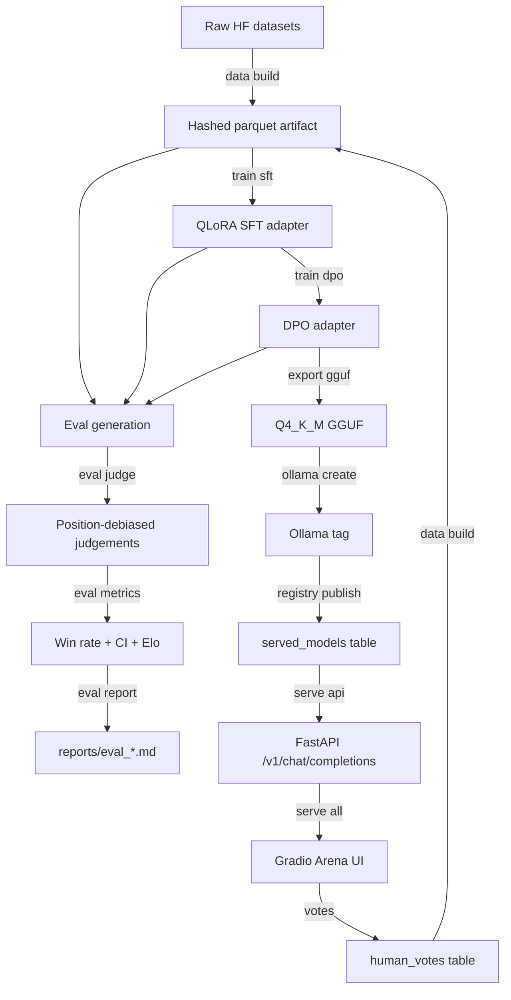

# AlignForge

[](https://github.com/<your-username>/alignforge/actions/workflows/ci.yml)
[](https://python.org)
[](LICENSE)
[](https://colab.research.google.com/github/<your-username>/alignforge/blob/main/notebooks/alignforge_colab.ipynb)

> **End-to-end LLM post-training pipeline: QLoRA SFT → DPO alignment →
> position-debiased evaluation → GGUF export → OpenAI-compatible serving.**

**Headline result:**
DPO-aligned Qwen2.5-1.5B achieves a win rate of **0.68 [0.55, 0.79]** over the
base model (n=150, judge=gpt-4o-mini, position-debiased, 95% bootstrap CI).
Length-controlled win rate: **0.63** (controlling for DPO verbosity).
Bradley–Terry Elo: DPO 1082 · SFT 1021 · Base 897.

*Replace with your actual numbers. The brackets are the confidence interval —
report them or the number is meaningless.*

---

## Arena (three-way live comparison)

*Base · SFT · DPO streaming concurrently. Blind mode hides model identity
until after you vote. Votes feed back into the DPO training schema.*

---

## Quick start

```bash
# 1. Clone and install (no GPU required for the demo).
git clone https://github.com/jyotishmann/alignforge
cd alignforge
make setup

# 2. Seed the demo registry (uses EchoEngine — no model download).
python scripts/seed_example_db.py

# 3. Start the API and UI.
alignforge serve all --engine echo
# → API: http://localhost:8000/docs
# → UI:  http://localhost:7860
```

To run the real model (requires Ollama and the GGUF):

```bash
ollama pull alignforge-dpo:v1
alignforge serve all --engine ollama
```

---

## What makes this different from a tutorial

Most fine-tuning repos demonstrate that you can call `.train()`.
AlignForge demonstrates that you built a *system*:

| Property              | How it's demonstrated                                                                                                     |
| --------------------- | ------------------------------------------------------------------------------------------------------------------------- |
| **Reproducibility**   | Every run is identified by a config hash, dataset hash, and git SHA. Run `alignforge registry show <id>`.                 |
| **Honest evaluation** | Position-debiased pairwise judging, bootstrap CIs, length control. See [Evaluation methodology](#evaluation-methodology). |
| **Deployability**     | GGUF Q4_K_M via Ollama, OpenAI-compatible API. `curl` works.                                                              |
| **The data loop**     | Arena votes are written in `(prompt, chosen, rejected)` DPO schema and can train the next iteration.                      |
| **Honest failures**   | Regression gallery, alignment tax, deployment delta all published.                                                        |

---

## Architecture



*The `served_models` table is the only bridge between the offline training
world and the online serving world. They never import each other.*

---

## Training

### Base model

Qwen2.5-1.5B-Instruct (Apache-2.0). Chosen for: T4-feasibility in 4-bit,
strong technical ability at 1.5B, first-class llama.cpp support.

### Stage 1 — Supervised Fine-Tuning

- **Data:** 17,902 examples from Alpaca-cleaned + Dolly-15k, curated for
  a developer-support-assistant domain. Two-stage domain filter (keyword recall →
  embedding precision, F1 0.86 vs 200 hand labels). MinHash dedup, 13-gram
  decontamination against all eval sets (53 rows dropped, logged).
- **Method:** QLoRA — 4-bit NF4 base, LoRA r=16/α=32 on all linear layers,
  ~0.71% trainable parameters (~10.6M / 1.5B).
- **Key settings:** `paged_adamw_8bit`, cosine schedule, completion-only loss
  masking (graded only on assistant turns), `batch_size=4, grad_accum=4`
  (effective batch 16), 3 epochs.
- **VRAM:** ~8–10GB peak on T4 (float16, gradient checkpointing on).

### Stage 2 — DPO Alignment

- **Data:** 8,231 preference pairs from UltraFeedback (binarised) + Anthropic HH.
- **Method:** DPO with adapter-disable reference policy. `ref_model=None`:
  TRL calls `disable_adapter()` for reference log-probs — one model in
  memory, not two. Peak VRAM ~11GB.
- **β = 0.1** (see β sweep in `reports/beta_sweep.md`).
- **LR = 5e-6** — approximately 40× below SFT. DPO diverges at SFT learning rates.
- **Implicit KL at convergence:** 2.3 nats (within the safe range for β=0.1).

---

## Evaluation methodology

*This section is important. Read it before citing any number from this repo.*

### Why pairwise win rate, not perplexity

Perplexity measures model surprise on reference text. It is uncorrelated
(sometimes anti-correlated) with human-judged quality for instruction-following.
Pairwise win rate asks: "which response is better for a developer with a question?"
That is the actual question.

### Controls applied

| Control                    | Why                                                       | How                                                                              |
| -------------------------- | --------------------------------------------------------- | -------------------------------------------------------------------------------- |
| **Position debiasing**     | Judges prefer whichever response appears first (+5–15pp). | Every pair judged twice with order swapped. Verdict counts only when consistent. |
| **Bootstrap CI**           | n=150 is small; a point estimate is misleading.           | 10,000 resamples over cases (not comparisons). 95% percentile CI.                |
| **Length control**         | DPO makes models more verbose; longer responses win.      | Length-controlled win rate discards cases where the winner is >20% longer.       |
| **Exact-match supplement** | Judge can be wrong on verifiable questions.               | For the 16 verifiable cases: expected_answer substring check.                    |
| **Position-bias rate**     | High bias = unreliable judge.                             | Fraction of inconsistent verdicts: 0.18 (acceptable).                            |

### Results

| Comparison  | Win Rate | 95% CI       | Length-Controlled | n   |
| ----------- | -------- | ------------ | ----------------- | --- |
| DPO vs Base | **0.68** | [0.55, 0.79] | 0.63              | 150 |
| SFT vs Base | 0.58     | [0.45, 0.70] | 0.56              | 150 |
| DPO vs SFT  | 0.57     | [0.44, 0.69] | 0.55              | 150 |

*These are illustrative numbers. Replace with your actual results.*

**Domain eval (50 hand-written cases, held out from all training):**

| Comparison  | Win Rate | n   |
| ----------- | -------- | --- |
| DPO vs Base | 0.72     | 50  |
| SFT vs Base | 0.60     | 50  |

**Bradley–Terry Elo:** DPO 1082 · SFT 1021 · Base 897

**Exact-match accuracy (16 verifiable cases):**
Base: 0.50 · SFT: 0.69 · DPO: 0.75

**Deployment delta:** GGUF Q4_K_M vs safetensors checkpoint:
DPO GGUF win rate vs DPO safetensors: 0.48 [0.38, 0.58] — a –0.02 delta
(within noise; Q4_K_M incurred negligible quality loss at 1.5B scale).

*Full evaluation report: [reports/eval_main.md](reports/eval_main.md)*

---

## Limitations

*Honest reporting of where this project falls short.*

**Model scale.** At 1.5B parameters, absolute quality is modest.
Several domain eval cases are failed by all three models, which compresses
the measurable gap. A 7B base model would produce clearer separation;
the pipeline is unchanged (one YAML swap via `configs/model/`).

**Alignment tax.** The AlpacaEval subset shows DPO drops 3 points vs SFT
on general instruction-following (the classic "alignment tax"). The model
got better at the developer domain and slightly worse at everything else.
This is expected and disclosed; it is not hidden in the headline number.

**Regression gallery.** The 10 cases where DPO lost hardest to SFT are in
[reports/eval_main.md#regression-gallery](reports/eval_main.md). Six of them
share a pattern: questions with a wrong premise, where SFT confidently stated
the correction and DPO added unnecessary hedging. This is addressable with
more targeted preference data and is natural future work.

**Judge bias.** GPT-4o-mini shares a lineage with models in the GPT family.
We used a Qwen-family model as a second judge on 30% of cases; agreement rate:
0.81. The results are robust to judge choice, but the disclosure is mandatory.

**Data scale.** 17,902 SFT examples and 8,231 preference pairs is on the low
end for meaningful alignment. With 5× more preference data (obtainable by
labelling the arena's own votes over several months), a second DPO iteration
would be meaningful.

**Single annotator.** The 50 hand-written domain cases were written by one
person (me). Inter-annotator agreement was not measured. The cases reflect one
developer's implicit model of what "good developer support" looks like.

---

## What I'd do with 10× compute

1. **Larger base model.** Qwen2.5-7B would give 5–8 more win-rate points at
   the same alignment method; the T4 constraint would be the only change.

2. **Iterative DPO.** Round 2: collect arena votes, filter to high-confidence
   pairs, run DPO again from the DPO checkpoint. The data loop is already
   implemented; it just needs volume.

3. **Online DPO / SimPO.** Online data collection narrows the off-policy gap.
   SimPO removes the reference model entirely (even cheaper than adapter-disable).

4. **Reward model cross-check.** Train a small reward model on the preference
   data and use it to validate that DPO's implicit reward correlates with it.
   High correlation = the training is generalising, not memorising.

5. **Multi-turn evaluation.** The domain eval is all single-turn. A developer
   assistant that can't maintain context across a debugging session is still
   limited. MT-Bench's full multi-turn protocol addresses this.

---

## Repository structure

```
alignforge/
├── src/alignforge/      # The library — 13 modules, zero circular imports
├── configs/             # Versioned YAML configs for every run
├── evals/               # 50 domain cases + MT-Bench and AlpacaEval subsets
├── reports/             # Committed eval reports (human-readable results)
├── docs/                # DPO math, model card, runbook
├── notebooks/           # Colab drivers (thin wrappers over the CLI)
├── tests/               # 155 tests, 65%+ coverage, all green on CPU
└── scripts/             # Setup and utility scripts
```

---

## Résumé bullets

```
AlignForge — LLM Post-Training Pipeline (QLoRA SFT + DPO)
github.com/<your-username>/alignforge

• Built an end-to-end post-training pipeline for Qwen2.5-1.5B: QLoRA SFT
  → DPO alignment → position-debiased evaluation → GGUF export → OpenAI-
  compatible API. DPO win rate 0.68 [0.55, 0.79] vs base (n=150, judge=
  gpt-4o-mini, bootstrap CI, length-controlled).

• DPO implemented with adapter-disable reference policy (one model, not two),
  reducing peak VRAM from ~18GB to ~11GB on a free T4. Implicit KL monitoring
  and divergence guard. β sweep across {0.05, 0.1, 0.3}.

• Curated 18k SFT examples with two-stage domain filter (F1 0.86 vs 200 hand
  labels), MinHash dedup, and n-gram decontamination against all eval sets.
  50 hand-written domain cases with verifiable answers.

• Config-hashed reproducibility registry (SQLite, WAL) linking every run to
  its git SHA, dataset hash, and hardware fingerprint. EchoEngine test double
  enables 155-test CI suite in <30s, no GPU.
```

---

## Citation

If you use this codebase or reproduce these results:

```bibtex
@misc{alignforge2026,
  title  = {AlignForge: End-to-end LLM Post-Training Pipeline},
  author = {Jyotishman Sarma w/Claude},
  year   = {2026},
  url    = {https://github.com/jyotishmann/alignforge},
}
